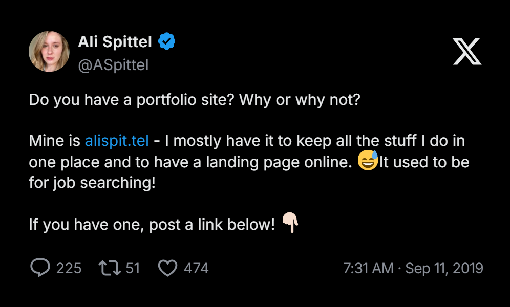

# Developer Portfolios

A list of developer portfolios for your inspiration

Have you built a portfolio? Are you proud of it?! Open a [Pr](./CONTRIBUTING.md) to this repo and

This repo was inspired by [Ali Spittel'S](https://twitter.com/ASpittel) tweet

This repo can serve as inspiration for your portfolio!

[Developer Portfolios Website](https://6e87v.hatchboxapp.com)

## Current Portfolio Count: 1834

**Jump to:** [A](#a) | [B](#b) | [C](#c) | [D](#d) | [E](#e) | [F](#f) | [G](#g) | [H](#h) | [I](#i)
| [J](#j) | [K](#k) | [L](#l) | [M](#m) | [N](#n) | [O](#o) | [P](#p) | [Q](#q) | [R](#r) | [S](#s)
| [T](#t) | [U](#u) | [V](#v) | [W](#w) | [X](#x) | [Y](#y) | [Z](#z) |
[Random Portfolio](https://s111ew.github.io/random-button-redirector)

---

## A

- [Aaaabad Ahmed](https://sawad.framer.website) [Software Engineer]
- [Aaabaad Al Aziz](https://red1-for-hek.vercel.app) [Full Stack Engineer]
- [Aaabad Touk](https://aaabadcode.com) [AI Engineer]
- [Aabraham James](https://seera.framer.website)
- [Aabu Sayed](https://aabu-sayed-portfolio.vercel.app) [Software Engineer & Web Developer]
- [Aaditya Domle](https://aadi.is-a.dev) [Full Stack Developer]
- [Aahana Bobade](https://aahanabobade.com) [Software Developer]
- [Aakarsh Bibhaw](https://aakarsh-devhq.vercel.app) [CS Undergrad | Full Stack & AI Engineer]
- [Aakash Rajbanshi](https://aakashrajbanshi.com.np) [Flutter Developer]
- [Aakash Sharma](https://aakash-sharma.netlify.app)
- [Aakhand Tajmirul](https://www.tajmirul.site) [Frontend Engineer] - Animated
- [Aaleksa Janjic](https://akkila.dev) [Full Stack Developer]
- [Aanand Madhav](https://aanandmadhav.com) [Senior PM | UX]
- [Aarab Nishchal](https://aarab.vercel.app) [Engineering Student | Full Stack Developer]
- [Aarav Sharma](https://aarav-sharma-liart.vercel.app) [Founder at Wensity | Sr. design engineer | UI/UX developer in Rune]
- [Aaron Dunphy](https://aarondunphy.com)
- [Aaryanna Simonelli](https://ashleighsimonelli.co.uk)
- [Aashay Wase](https://aashay-dev-ed.develop.my.site.com/AashayWase/s) [Salesforce Developer]
- [Aashir Khan](https://portfolio-n4sn.vercel.app)
- [Aashish Jaini](https://aashishjaini.me) [Freelancer | AI & Full Stack Dev]
- [Aashutosh Rathi](https://aashutosh.dev)
- [Aathif Zahir](https://az-dev.vercel.app)
- [Aaweł Szostak](https://pawelszostak.vercel.app) [Full Stack Dev | Freelancer | AI & ML Student]
- [Aayush Bharti](https://aaabaa-aayush.vercel.app) [Developer | Freelancer | Problem Solver]
- [Aayush Mishra](https://aayush-mishra.xyz) [Front-End Developer]
- [Aayush Raj](https://ayushcmd.me) [Full Stack Developer | Problem Solver | AI & ML | React & Node.js Developer]
- [Aayush Sood](https://www.aayushsood.com)
- [Abbas Raza](https://abbasraza.dev) [Software Engineer | Freelancer | AI & Blockchain Enthusiast]
- [Abdalla Elradi](https://aelradi.engineer) [AI Automation Engineer]
- [Abdalwahed Aldaghir](https://awrs.me/en)[Software Engineer | Flutter Developer | Mobile Developer]
- [Abdelaziz El Arassi](http://aelarassi.com)
- [Abdelrahman Saed](https://bnsaed.com/) [Senior Mobile Engineer]
- [Abdenassar Amimi](https://abdenassar-portfolio-4smfcqph6-abdenassaramimi99-gmailcom.vercel.app)
- [Abdul Basit](https://abdulbasit-005.vercel.app) [Full Stack Web Developer | MERN Stack | AI Automation (n8n)]
- [Abdul Jaber](https://aj7.is-a.dev)
- [Abdul Mannan](https://mannan.io) [Senior Front-end Engineer]
- [Abdul Momin](https://abdulmomin.dev) [Software Engineer | Full Stack Engineer]
- [Abdul Quddus](https://quddus.is-a.dev) [Typescript Developer]
- [Abdul Rahman](https://abdulrahman.id)
- [Abdul Rauf](https://armujahid.me)
- [Abdul Rehman Waseem](https://abdulrehmanwaseem.me) [Full Stack Developer | 3D Web Specialist]
- [Abdul Samad](https://samadd.vercel.app) [Software Developer]
- [Abdul Wahab Khan](https://wahab-khan.github.io/Abdul-Wahab-Khan) [Mobile Developer]
- [Abdullah Ahmed](https://abdallaahmed.icu) [Full Stack Developer]
- [Abdullah Al Monir](https://abdullahalmonir.com) [Full Stack Developer]
- [Abdullah Ayoola](https://ayooladev.vercel.app)
- [Abdullah Bozdağ](https://abdullahbozdag.com) [Full Stack Developer]
- [Abdullah Iqbal](https://abdullah-portfolio-dev.vercel.app) [Full Stack Developer]
- [Abdullah James](https://portfolio-website-abdullah-jamess.vercel.app) [Ai | Full Stack Developer]
- [Abdullah Waheed](https://abdullahw-portfolio.vercel.app) [Front-End Developer]
- [Abdullah Warraich](https://abdullah-warraich-ch.vercel.app)
- [Abdur Rahman](https://itsmeabdur.in) [Full Stack developer]
- [Abdusamad Malikov](https://www.abdusamad.uz)
- [Abhay Rana](https://abhayrana.com) [Full Stack Developer]
- [Abhijeet Bhale](https://abhijeetbhale.github.io/Portfolio) [Software Engineer]
- [Abhijeet Singh Parihar](https://abhijeet-singh-parihar-portfolio.vercel.app) [Software Engineer]
- [Abhijit Mondal](https://abhijitmondal.info) [Full Stack Web Developer | React, Next.js, Python]
- [Abhinandhan Devadiga](https://abhicodestudio.com)
- [Abhinav Galodha](https://www.galodha.com)
- [Abhinav Jaiswal](https://iabhinav.me) [Software Engineer]
- [Abhinav Jaiswal](https://terminal.iabhinav.me) [Terminal Portfolio]
- [Abhinav Kumar](https://my-portfolio-flax-kappa.vercel.app)
- [Abhinay Thakur](https://abhinaythakur.com)
- [Abhisek Panda](https://abhisekpanda072.vercel.app) [Front-End Developer | MERN Stack Developer | Freelancer]
- [Abhishek Agrawal](https://abhish0.github.io/My-Portfolio/) [Full Stack Developer]
- [Abhishek Anand](https://abhishekdev-portfolio.vercel.app) [Software Engineer | Full Stack Developer]
- [Abhishek Bhardwaj](https://www.imabhishek.site)
- [Abhishek Ganvir](https://abhishekganvir.vercel.app) [Full Stack Developer]
- [Abhishek Ghimire](https://www.abhishekg.com.np) [Software Engineer]
- [Abhishek Kandel](https://abhishekkandel.com.np)
- [Abhishek Panchal](https://skillstackpanchal.vercel.app)
- [Abhishek Panthee](https://abhishekpanthee.com.np)
- [Abhishek Sah](https://www.abhisheksah.dev) [Software Engineer]
- [Abhishek Singh](https://www.abhishekworks.com) [Full Stack Developer]
- [Abinash Sharma](https://abinash-sharma.pages.dev) [Software Developer | MCA | Cloud | AI]
- [Abraham Bankole](https://abrahambankole.dev)[Software Engineer | Full Stack Web Developer]
- [Abu Suhaib](https://ceo.pronexus.in) [Leading Startup Founder]
- [Abubakr Mufutau-Oseni](https://abubakrmo.com)
- [Achyut Katiyar](https://www.achyutkatiyar.com) [Full Stack Developer| UI/UX Desginer]
- [Adam Alston](https://www.adamalston.com)
- [Adam Williams](https://adjwilli.github.io)
- [Adarsh Kumar](https://portfolio-e7gt.onrender.com) [Full Stack Developer | Software Developer]
- [Adarsh Singh](https://adarshsinghh.vercel.app) [Software Engineer]
- [Adebanjo Stephen](https://myportfoliome.vercel.app) [Sofware Engineer]
- [Adham Dannaway](https://www.adhamdannaway.com) [Ux/Ui Designer & Frontend Developer]
- [Adina Hawaldar](https://www.adinaa.me) [Web Designer & Developer]
- [Adithya Krishnan](https://www.adithyakrishnan.com)
- [Aditi Arya](https://aditiarya.netlify.app) [Software Engineer]
- [Aditya Chaudhary](https://aditya-portfolio-dusky.vercel.app)
- [Aditya Chauhan](https://aditya-chauhan.vercel.app) [Full Stack Developer]
- [Aditya Domle](https://adittya.site) [Software Developer | Freelancer]
- [Aditya Dubey](https://adityacodes.in)
- [Aditya Dutt Pandey](https://www.adpandey.com) [Founder | Backend Engineer | System Architect]
- [Aditya Kumar Gupta](https://aditya30051993.github.io/my-portfolio) [Doctor & Developer]
- [Aditya Kumar Srivastava](https://adityasri.in) [Full Stack Developer (Mern & Java Springboot Developer)]
- [Aditya Kumar](https://www.adityakr.com)
- [Aditya Medhe](https://aditya.medhe.in)
- [Aditya Pillai](https://aditya-pillai.vercel.app) [Computer Science Undergraduate | SWE Intern]
- [Aditya Poojary](https://adityapoojary.dev) [Software Developer]
- [Aditya Punmiya](https://adityapunmiya.com) [Software Engineer]
- [Aditya Rahmad](https://adxxya30.vercel.app) [Software Developer]
- [Aditya Raj Srivastava](https://portfolio-lilac-eight-33.vercel.app) [Full Stack Developer]
- [Aditya Seth](https://adityaseth.in) [Software Developer & DevOps Architect]
- [Aditya Thakur](https://adityathakur.me) [Software Engineer | Full Stack Engineer]
- [Aditya Vikram Singh](https://www.adityavsingh.com)
- [Aditya](https://aditya-a-portfolio.vercel.app) [Full Stack Developer | Software Developer]
- [Adityakumar Sinha](https://aditya113141.github.io)
- [Adrian Hansen](https://adrian-hansen-dev.github.io/portfolio/) [Software Developer]
- [Advait Nair](https://advaitnair.org) [Full Stack Engineer]
- [Adwitya](https://adwityac.netlify.app)
- [Afam Olie](https://afamolie.com) [Full Stack Developer]
- [Afaq Awan](https://afaq35202.github.io) [Mobile App Developer]
- [Afjal Ansari](https://md-afjal-ansari.onrender.com) [Mern-Stack Developer]
- [Aftab Alam](https://datasciencefolio.streamlit.app) [An Open-Source, Customizable Portfolio Template For Ai/Ml/Dl Developers And Data Scientists]
- [Aggelos Ladas](https://aggelosladas.com) [Spring Boot Backend | Android Developer]
- [Agney Menon](https://agney.dev)
- [Agrawal Pratham](https://agrawalpratham.in)
- [Ahamed Kabeer](https://aktech27.github.io) [Mern Full Stack Developer]
- [Aharon Zilberman](https://ahronsilv.dev) [Full Stack & React Native Engineer | Mobile Infrastructure, Native Integrations & AI-assisted Delivery]
- [Ahmad Almory](https://ahmedalmory.github.io/portfolio)
- [Ahmad Awais](https://ahmadawais.com)
- [Ahmad Faraz](https://theahmadfaraz.com) [Full Stack Developer]
- [Ahmed Abdelhafiez](https://nevo.is-a.dev) [Front-End Web Developer]
- [Ahmed Allali](https://portfolio-ahmed-allalis-projects.vercel.app) [Front-End Developer | ahallali.duckdns.org]
- [Ahmed Tokyo](https://ahmedtokyo.com) [Senior Software Engineer | Ai]
- [Ahmet Eren Odacı](https://ahmete.ren)
- [Aishani Pachauri](https://aishanipach.netlify.app)
- [Aitezaz Sikandar](https://aitezazdev.vercel.app) [Full Stack Developer]
- [Ajay Kannan](https://ajaykannan.netlify.app)
- [Ajay Pawar](https://ajay-pawar.vercel.app) [Full Stack Developer]
- [Ajink Gupta](https://ajinkgupta.vercel.app)
- [Ajvad Laseen](https://ajvadlaseen.com) [Full Stack Developer]
- [Akash Balasubhramanyam](https://akashblsbrmnm.github.io) [C Developer]
- [Akash Kumar](https://portfolio-site-git-main-akash-kumar5s-projects.vercel.app) [Quant Developer | Full Stack]
- [Akash Rajpurohit](https://akashrajpurohit.com)
- [Akash Samanta](https://akashcraft.ca) [Full Stack Developer]
- [Akash Santra](https://my-portfolio-one-roan-33.vercel.app) [Full Stack Developer | AI & Open Source Contributor]
- [Akashkumar Jadav](https://akashjadav.com) [Founder & Senior Full Stack Engineer]
- [Akhileswar Kamale](https://akhileswar6.github.io/Portfolio/) [Full Stack Developer]
- [Akhil Pillay](https://akhil-devs-portfolio.vercel.app) [Full-Stack Dev | Agentic Systems Architect]
- [Akhshy Ganesh](https://akhshyganesh.github.io) [Full Stack Developer | Solution Architect]
- [Akira Yoshiro](https://gungho0619.vercel.app) [Full Stack Developer Web | Blockchain]
- [Akli Massinissa Sadek](https://sadoukas.com) [Full Stack Developer | Freelance Services]
- [Akshat Gupta](https://www.akshatvg.com)
- [Akshat Kotpalliwar Alias Integeralex](https://realtalkportfolio.vercel.app) [Full Stack Developer | Old School Portfolio]
- [Akshay Abraham](https://akshayabraham.vercel.app?utm_source=github&utm_medium=readme&utm_campaign=dev_portfolios) [Aspiring Physicist | Backend & Research-Oriented Developer| Frontend For Hobby]
- [Akshay Santhoshkumar](https://akshaysanthoshkumar.vercel.app) [Full Stack 3D Software Developer]
- [Akshay](https://devakshay.vercel.app)
- [Al Amin](https://alamin-portfolio-site.vercel.app) [Full Stack Developer]
- [Alan Hamlett](https://ahamlett.com) [Founder & Ceo @Wakatime]
- [Alan Khalili](https://www.alan-khalili.com)
- [Alejandro Gomez](https://alejandro-gomez.vercel.app)
- [Alejandro Sobko](http://alejandrosobko.com)
- [Aleksandar Pajić](https://www.aleksandarpajic.co) [Software Developer & Designer]
- [Aleksei Ross](https://ross.aleksei.digital/98?ref=emmabostian) [Tech Lead & Sr. Software Engineer]
- [Alestor Aldous](http://alestor123.github.io)
- [Alex Michailidis](https://alexandros.tech)
- [Alexandre Fernandes](https://alexandrefernandes.dev) [Software Engineer | AI/ML & Full Stack]
- [Alexandre Trotel](https://www.alexandretrotel.org)
- [Alexey Golub](http://tyrrrz.me)
- [Alexis De Jesus](https://www.aalexis.fr) [Full Stack Developer]
- [Alfred Dagenais](https://alfreddagenais.com)
- [Ali Ahtisham](https://aliahtisham.pro) [Professional Web Developer]
- [Ali Mohsin](https://www.ali-ch.dev) [Architect Of Ai-Driven Systems | Machine Learning, Security, And Full Stack Engineering]
- [Ali Saleem](https://alisaleem252.com) [Web Developer & Web Programmer]
- [Alif Jobaer](https://alifjobaer12.vercel.app) [Full-Stack MERN & Next.js Developer | IoT & Algorithmic Problem Solving]
- [Allan Im](https://allanim.com) [Software Engineer]
- [Allan Muturi](https://allanmuturi.vercel.app)
- [Allen Koch](https://allenkoch.dev/) [Full Stack Developer & AI Builder]
- [Almaz Bisenbaev](https://almazb.vercel.app) [Web Developer]
- [Aloys Dillar](https://trolologuy.github.io)
- [Althruist](https://althruist.fyi) [Game Developer]
- [Alucard](https://dg.aluc.me) [Full Stack Engineer | AI, Founder]
- [Alvalens](https://www.alvalens.my.id)
- [Aman Anku](http://amananku26.github.io)
- [Aman Bam](https://my-portfolio-d7jf.vercel.app) [Full Stack Developer]
- [Aman Kumar](https://amankumar.ai) [Product | Ai Engineer]
- [Aman kumar Jha](https://Amanbuilds.me) [AI Engineer & Full-Stack Developer] - Animated
- [Aman Mittal](http://amanhimself.dev)
- [Aman Rai](https://obliviousaman.netlify.app) [Frontend Developer | Vue.js, GSAP Animations, Bilingual English/Japanese Web Apps]
- [Aman Rawat](https://amanrwt.com) [AI-Native Software Engineer | Frontend Developer]
- [Aman Shrivastava](https://aman04.netlify.app)
- [Ameer Muavia Shah](https://maveeshah.github.io/projects.html) [Frappe | Erpnext | Python]
- [Ameya Ramteke](https://ameyajarvis.qzz.io) [AI & DS Student]
- [Amine Rebbouh](https://main.dodjas56cfa3.amplifyapp.com)
- [Amir Akbulut](https://amirdev.nl)
- [Amirali Rashidi](https://amiralirashidi.github.io) [Front-End Developer]
- [Amit Kumar Raj](https://amitkumarraj.vercel.app) [Full Stack Developer | MERN]
- [Amit Sah](https://amit-sah.com.np) [Ios Developer | Backend Engineer (Node.Js, Llms) | Cloud Computing]
- [Amresh Prasad Sinha](https://amreshsinha.vercel.app)
- [Amruth Pillai](https://amruthpillai.com)
- [Ana Sá Oliveira](https://ana.is-a.dev)
- [Anadi Sharma](https://asharma.tech) [Software Engineer | Cse'25 Iit Jodhpur]
- [Anamuddin Ahmad](https://github.com/AnamuddinAhmad/Portfolio_1) [Software Engineer & Freelancer]
- [Anand Thakkar](https://www.anandthakkar.com) [Software Developer & Tech Creator]
- [Anandhu Sajan](https://anandhusajan.com) [Full Stack Developer | Cybersecurity & Network Forensics Specialist | UI/UX | NextJs • React Native • WordPress • Creative Designer]
- [Ananya Biswas](https://dub.sh/ananyabiswas)
- [Anas Boubechra](https://cschad.com)
- [Anav Chand](https://www.anav.dev) [Software Engineering Student | DevOps & AI Enthusiast.]
- [Anay Paraswani](https://anayparaswani.dev)
- [Andrea Ojeda](https://www.andreaoz.com)
- [Andrej Sharapov](https://sharapov.dev)
- [Andres Alcaraz](https://andres-alcaraz.netlify.app)
- [Andrew Smith](https://andrew.codes)
- [Andrew Woods](https://andrewwoods.net)
- [Andrey Perestoronin](https://prs2rnn.github.io) [Python Backend Developer]
- [Andrianaivo Blaise Ismael](https://andrianaivo-ismael.vercel.app/admin)
- [Andrii Ponomarienko](https://andriiponomarenko.vercel.app) [Frontend Developer | React, Vue, Typescript]
- [Andrii Zontov](https://lwjerri.dev)
- [André De Faria](https://andredfaria.github.io)
- [André Souza](https://an3dree.dev) [Backend Developer]
- [Andy Bell](https://andy-bell.design)
- [Andy Wong](https://www.andy-hk.com) [Full Stack Developer | Mobile App Developer]
- [Aneeth Kumaar](https://akwastaken.github.io) [Graphic Designer | Programmer]
- [Angkon Kar](https://angkonkar.netlify.app) [Frontend Engineer | Computer Engineering Student]
- [Anh Duong](https://dhlananh-dev-portfolio.vercel.app) [Frontend Developer]
- [Anh Nguyen](https://anhnq15.github.io) [Software Engineer]
- [Anik Ahammed Khan](https://anikahammedkhan.com)
- [Aniket Joshi](https://aniketj.dev) [Software Architect]
- [Aniket Kudale](https://aniket.co)
- [Anil Khatri](https://imkaka.github.io)
- [Anil Peter](https://anilpeter.vercel.app) [Frontend Developer]
- [Anirban Banerjee](https://anirban-portfolio-delta.vercel.app) [Data Architect | Data & AI Engineer]
- [Anish Biswas](https://anish7.me) [Full Stack Dev]
- [Anish Navalgund](https://anishknavalgund.vercel.app) [AI, Robotics and Automation]
- [Ankit Dey](https://dub.sh/ankitdey)
- [Ankit Jha](https://ankitjha.vercel.app) [MERN stack developer]
- [Ankit Mohanty](https://ankitmohanty.vercel.app) [Software Developer]
- [Ankit Raj](https://neokit.app) [Full Stack Developer | Web & App | DevOps]
- [Ankit Roy](https://ankit-roy.netlify.app) [Software | Backend | Bot Developer and AI Automation]
- [Ankur Bag](https://www.ankurbag.tech) [Full Stack Dev with GenAI]
- [Ankush Minda](http://ankushminda.com)
- [Ankush Rathour](https://ankushrathour.com) [Software Engineer | Full Stack Specialist]
- [Anshul Chauhan](https://anshulchauhan.dev) [Full Stack Developer | Ios-Style Portfolio]
- [Anshul Dev](https://github.com/AnshulGora/portfolio_template_v1) [Software Developer | Web Solutions]
- [Anshul Gora](https://anshulwork.netlify.app)
- [Anshul Raman](https://www.anshulraman.com)
- [Anshuman Jha](https://anshuman-jha.vercel.app)
- [Anthony MAHEFASOA](https://thony32.tech)
- [Anthony Odumodu](https://antonodu.netlify.app)
- [Antoine Dangleterre](https://antoinedangleterre.com)
- [Anton Bojko](https://mrtoxas.github.io/cv/portfolio)
- [Anton Manaev](https://antonmanaev.name) [AI | Full Stack Developer | Designer]
- [Antonio Ferreiro](https://toniferr.github.io)
- [Antonio Ranivoarison](https://tsioryantonio.vercel.app) [Full Stack Developer & Aspiring AI / Ml Engineer]
- [Antony Jude Shaman](https://antonyjudeshaman.vercel.app)
- [Antônio Junior](https://portfolio-antonio-ten.vercel.app)
- [Anubhav Singh](https://mylivecv.com/mylivecv/pf-anubhav) [Full Stack Developer]
- [Anuj Magar](https://anujmagar.com.np) [Full Stack Developer]
- [Anukool Patel](https://anukool.me) [Full Stack Developer | AI]
- [Anup Pradhan](https://www.anuppradhan.in) [Full Stack Developer | Terminal Portfolio]
- [Anurag Affection](https://anuragaffection.vercel.app)
